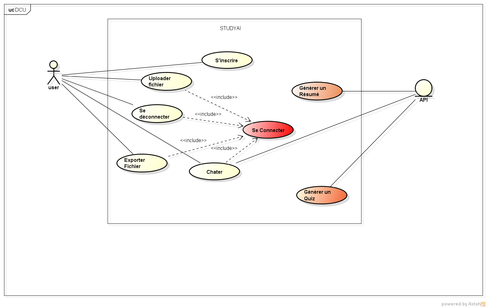
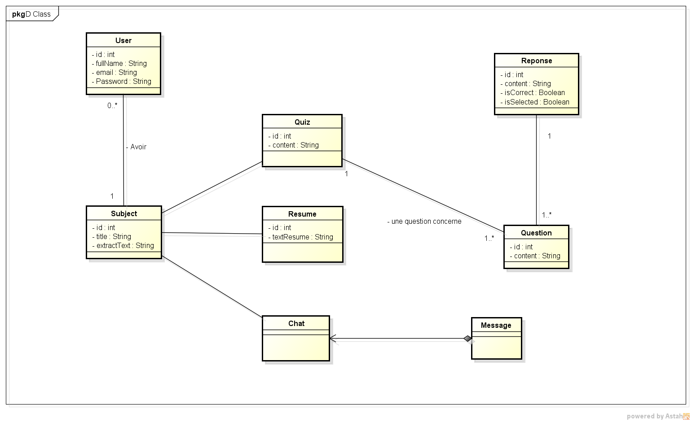
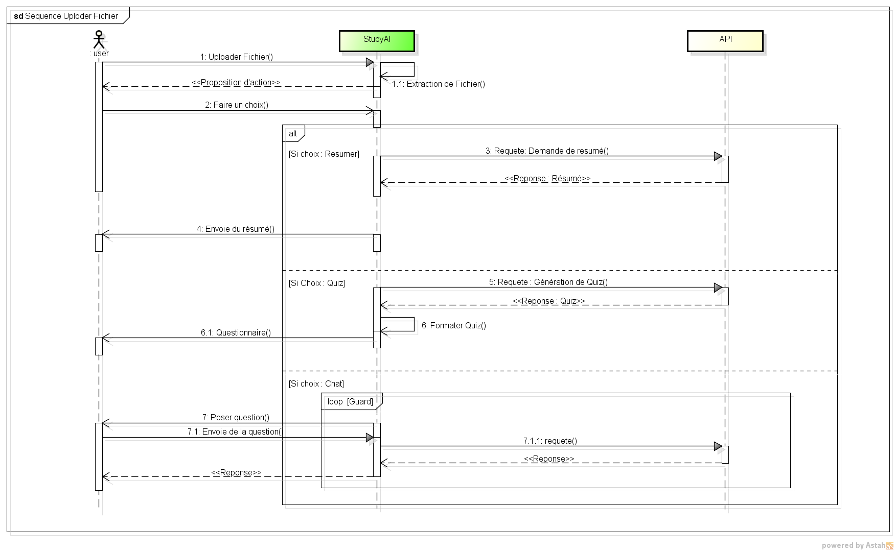

# Architecture & Design

## 1. Introduction

Ce document décrit l’architecture logicielle du projet. Il a pour objectif de permettre à tout nouveau contributeur de comprendre rapidement la structure du système, ses entités principales et leurs interactions.

L’application permet à un utilisateur de créer des sujets
(Subject) pouvant être de type Quiz, Résumé ou Chat.

## 2. Vue d’ensemble de l’architecture

L’architecture repose sur un modèle orienté objet. Chaque fonctionnalité principale (Quiz, Résumé, Chat) est rattachée à un Subject, lui-même lié à un User.

Les données sont organisées autour des entités suivantes :
- User
- Subject
- Quiz
- Question
- Response
- Resume
- Chat
- Message

## 3. Modèle statique

Le diagramme de classes UML ci-dessous représente les relations entre les entités principales du système.

- Un User peut posséder plusieurs Subjects
- Un Subject peut être associé à un Quiz, un Resume ou un Chat
- Un Quiz contient plusieurs Questions
- Une Question possède plusieurs Responses dont une ou plusieurs peuvent êtres correcte

## 4. Description des entités
### User
Représente un utilisateur de l’application.

Attributs :
- id : identifiant unique
- fullName : nom complet
- email : adresse email
- password : mot de passe hashé

Responsabilité :
- Créer et gérer ses sujets (Subject)
- 
### Subject
Représente un sujet créé par un utilisateur.

Attributs :
- id
- title
- extractText

Relations :
- Un Subject appartient à un User
- Un Subject peut être lié à un Quiz, un Resume ou un Chat

### Quiz
Représente un questionnaire associé à un Subject.

Attributs :
- id
- content

Relations :
- Un Quiz contient plusieurs Questions

### Question
Représente une question d’un quiz.

Attributs :
- id
- content

Relations :
- Une Question possède plusieurs Responses

### Response
Représente une réponse possible à une question.

Attributs :
- id
- content
- isCorrect
- isSelected

### Resume
Contient le résumé généré pour un Subject.

Attributs :
- id
- textResume

### Chat
Représente une discussion associée à un Subject.

### Message
Représente un message envoyé dans un Chat.
Un Chat est composé de plusieurs Messages.
## 5. Modèle dynamique

### Scénario nominal : création d’un quiz
1. L’utilisateur crée un Subject
2. Il choisit le type "Quiz"
3. Le système génère un Quiz
4. Le Quiz contient plusieurs Questions
5. Chaque Question contient des Responses

## 6. Choix techniques

- Architecture orientée objet
- UML pour la modélisation
- Java pour l’implémentation (Back-end)
- Next pour l'implémentation (Front-end)
